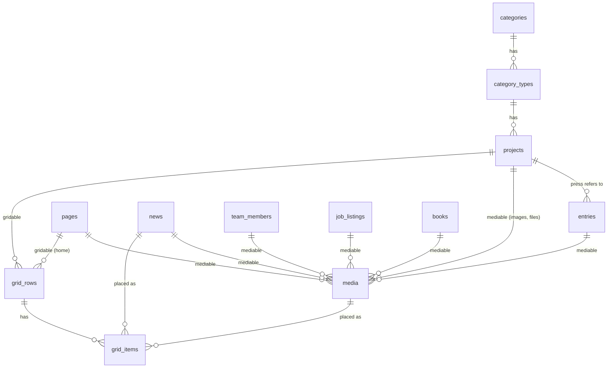

# rework.strut.ch — Phase 0 analysis

Date: 2026-09-27 · Status: **awaiting approval (Checkpoint 0)**

Sources (read-only):

| Role | Path | HEAD |
|---|---|---|
| **Current** | `strut.ch` | `e730c02` Merge `feature/highlight-slideshow-video` (2026-09-27) |
| **Updated** | `cms.strut.ch` | `58e55a3` dark mode for dashboard (2026-04-02) |
| **Template** | `forrerzimmermann.ch` | `19c6a06` chore: remove .env.example (2026-05-28) |

The Current DB was inspected through the MAMP socket with SELECT statements only (MySQL 5.7.39, schema `strut.ch`). All counts below come from that local database. **Open question Q1:** is this local DB an up-to-date copy of production? It has 0 video rows, although video support shipped in 2025/2026.

---

## 1. Versions

| | Current | Updated | Template | Latest stable today |
|---|---|---|---|---|
| PHP | ^8.2 (Herd 8.2) | ^8.2 | ^8.3 (CI 8.4) | 8.4 local CLI (8.5 available) |
| Laravel | 11.44.2 (old L5 skeleton: Kernel, string routes, `App\User`) | 12.46.0 | **13.7.0** | 13.33.0 |
| Test framework | PHPUnit (unused) | Pest 3.8 / PHPUnit 11 | **Pest 4.6 / PHPUnit 12** | Pest 5.2 |
| Vue | 2.7 + Vuex 3 + vue-router 3 | 3.5.27, router 5, Pinia 3 | **3.5.27, router 5.0, Pinia 3.0** | Vue 3.5.43, router 5.3, **Pinia 4.0** |
| Build | laravel-mix 6 + Sass | Vite 7.3 | **Vite 7.3.2** | **Vite 8.3** |
| CSS | SCSS, no Tailwind | Tailwind 4.1.18 | **Tailwind 4.1.18** (CSS-first `@theme`) | Tailwind 4.3.3 |
| Editor | TinyMCE 5 | TipTap 3.19 | TipTap 3.19 | TipTap 3.31 |
| Images | Intervention 3 (GD), pre-generated variants | Glide 3.1 | **Glide 3.2 (Imagick)**, on the fly | |
| Node | none pinned (v22.19 local) | none | none (v22.19 local) | add `.nvmrc` = 22 |

Upgrade plan for step 1.1: minor updates within majors (Laravel 13.x, Vue, Tailwind 4.3, TipTap), plus **Pest 4 → 5, Vite 7 → 8 and Pinia 3 → 4**. The last three are major versions, so I will upgrade them one at a time with the test suite in between, and report any breakage (**Q2**).

---

## 2. Template module inventory (forrerzimmermann.ch)

Architecture to keep:
- `app/Actions/<Module>/{Store,Update,Delete,Reorder}Action` (`execute()`), slim `Http/Controllers/Api/*`, FormRequests with German messages, JsonResources.
- `HasUuid` route binding (uuid) and `HasPublish` scope.
- Session auth (Breeze leftovers) with the SPA at `/dashboard/{any?}` and the JSON API at `/api/dashboard/*`.
- Admin SPA in `resources/js/app`: router, `api/<module>.js`, Pinia stores, composables, UI kit.
- Pest feature tests on sqlite in memory.

| Module | Keep / adapt / remove | Notes |
|---|---|---|
| Auth (login, password reset) | **keep** | Publish `lang/de/auth.php` + `passwords.php` (currently falls back to English) |
| Users | **keep** | Remove `SeedUser` (plaintext credentials in source); keep `app:create-user` |
| Media (polymorphic `media`, Upload/Attach/Normalize/Crop/Variant, Glide `/img`, `<x-media.image>`) | **keep, core** | Fixes: persist `is_teaser` on attach, extract `HasMedia` trait + `useEntityMedia()` composable (payload mapping is copied into every Form.vue), **signed Glide URLs / preset whitelist**, temp cleanup command, drop broken media library page (or fix it), add `collection` column (see §6) |
| Dashboard shell + UI kit (DataTable, Drawer, Dialog, Tabs, Editor, Toasts, `useConfirm`, `useUnsavedChanges`) | **keep** | Adapt sidebar; decouple `LinkPicker`/`Toolbar` from FZA pages |
| SEO settings (singleton with one column per FZA page) | **adapt** | Replaced by `meta_description` on `pages` (§6). Scope `SeoComposer` (currently runs a query on *every* view render) |
| Contact (singleton) | **remove** | strut stores contact/imprint as rich text pages → `pages` |
| Projects + Topics | **adapt** | Good structural base; fields/URLs replaced by strut's. Topics → `categories` + `category_types` |
| Team, Jobs | **adapt** | Rename fields to strut's |
| Landing slides | **remove** | Replaced by the homepage grid (highlight area) |
| Atelier pages | **remove** | The pattern is reused as `pages` |
| Public site shell (Chroma ST font, logo, Alpine menu, Swiper, `shy.js`) | **remove** | Phase 2 is a complete rewrite in vanilla JS; keep only the structure pattern (Blade components, `site.css`, `js/modules/*`) |
| `seed-*` commands, `docs/requirements` (weberbrunner), stale README, `ProfileUpdateRequest`, `js/bootstrap.js` | **remove** | |

Template bugs I will fix while porting:
- Detail routes don't check `publish`.
- Duplicate slug causes a 500.
- No role checks.
- `.env.example` is missing; mixed tabs/spaces with no `pint.json` (I'll follow the Template's dominant style: tabs).

---

## 3. Content types in Current (legacy DB)

Every text field is a spatie-translatable JSON `{"de": …}`. `en` is always null, and there is only one locale.

| Table | Rows (published) | Fields | Relations / notes |
|---|---|---|---|
| `categories` | 3 (3) | name*, publish, order (all -1), show_types | Wohnen / Gewerbe / Öffentlich. PDF routes hardcode ids 1–3 |
| `category_types` | 7 (7) | name_singular*, name_plural*, order, publish | FK category |
| `projects` | 62 (62) | title* (teaser title, nullable), name*, location*, year, description* (HTML), info* (HTML), has_detail (35 = 1), status enum(Ausgeführt, In Planung, Studie), competition enum(1. Preis, 2. Preis, Andere, null), publish, order | FK category + category_type (**always consistent**: 0 mismatches). 7 descriptions contain ~40 KB of pasted MS-Word XML/comments |
| `project_images` | 431 (431) | name (file), caption* (all empty), order (all -1), is_preview_type/status/year (**all 0**), is_grid (314), publish | 43 projects have images; 19 have none |
| `project_videos` | **0** | name, caption, order, publish | new in 2025; see Q1 |
| `project_files` | 24 (24) | name (PDF), caption* (empty), order, publish | project documentation PDFs → "Downloads" page |
| `project_grids` | 130 | project_id, layout_id, order, publish (all 1) | no FKs |
| `project_grid_elements` | 314 | grid_id, position, project_id (redundant, always consistent), project_image_id, project_video_id | |
| `project_grid_layouts` | 7 | key | |
| `home_grids` | 27 | layout_id, order, publish (all 1) | no FKs; ordered by `order` (two rows at -1) |
| `home_grid_elements` | 67 (61 in rows + **6 highlight**, `grid_id = 1`, which has no `home_grids` row) | grid_id, position, news_id (22), project_image_id (45), project_video_id (0), action enum(keep, delete), environment enum(production, development) | all 67 are keep/production |
| `home_grid_layouts` | 11 | key | |
| `news` | 26 (24) | date* (free text: "August 2026", "Jahresende 2025"), title*, subtitle*, text* (plain), link*, linkText*, media (image), publish | used **only** as home grid tiles (22 placed) |
| `content` | 4 | key (about, contact, imprint, jobs), title*, text* (HTML), has_media, publish | |
| `content_images` | 2 | name, caption, content_id, publish | about → team photo, jobs → office photo |
| `team` | 13 (11) | name (= last name), firstname, role*, position*, phone, email, cv* (HTML), media (portrait), order, publish | |
| `jobs` | 2 (0) | title*, lead*, info* (HTML), media (= **PDF**), order, publish | `/jobs` falls back to the `content.jobs` text |
| `books` | 15 (15) | title (plain), description* (spec text with `\n`), info* (HTML), url (**URL or e-mail** → mailto), media (cover), order | |
| `press` | 37 (35) | title*, description*, year, url, media, file (PDF), project_id (30 set, no FK) | |
| `awards` | 13 (13) | title*, description*, year, url, media, file | same shape as press |
| `lectures` | 10 (10) | title*, description*, year, url, media, file | same shape as press |
| `users` | 3 | | the admin users are not migrated (create them fresh; **Q9**) |

`*` = translatable JSON. Legacy/unused tables (`posts`, `grids`, …) are not present in the DB.

Behaviour worth preserving:
- **Ordering.** Frontend ordering is `order ASC` (team, jobs, books, projects within a type), `year DESC` (press, awards, lectures, Werkliste) and `position` within grids. Many `order` values are -1 or tied, so the import will convert (order, id) into a clean 0..n `sort_order`.
- **Project detail pages.** They use `findOrFail` on `published()` and ignore `has_detail` (a no-detail project URL still renders). Menu and prev/next only list `has_detail = 1`.
- **Werkliste pages.** Status, year and type views are driven by the project fields. The year view shows a thumbnail only when `is_preview_year` is set, which it never is, so the preview flags are effectively dead (**Q5**).
- **PDF features.** The Werkliste PDFs (dompdf, 8 variants) and per-category merged project PDFs (libmergepdf) must be kept (**Q7**).

---

## 4. How Updated mapped it, and where that is weak

Updated (Laravel 12) re-created most modules on the Template's architecture: projects with a project grid, categories/types, awards, books, content, jobs (`domain_jobs`), lectures, news, press and team. It has **no homepage, no public frontend and no videos in grids**. Its `app:import` parses a stale SQL dump that lacks `home_grid_*` and `project_videos`.

| # | Weakness in Updated | Consequence / fix in the new model |
|---|---|---|
| W1 | Homepage not modelled; `project_grids.project_id` is a hard FK | Grid can't be shared → **polymorphic `grid_rows.gridable`** (§5) |
| W2 | Grid items are image-only (`media_id`) | No videos or news tiles → items reference `media` **or** `news` |
| W3 | No unique (grid, position); `layout_key`/`position` unvalidated; media not checked to belong to project; `media_id nullOnDelete` leaves empty items; routes not scope-bound | Unique index, config-validated layout/position, ownership rule, `cascadeOnDelete`, `scopeBindings()` |
| W4 | One layout defined in 4 places (PHP config, icons JS, hard-coded `v-if` per layout in `GridRow.vue`, CSS); sm/lg sizes only implied by the key name | **Single data-driven layout spec** in `config/grids.php`, rendered generically by Vue *and* Blade (§5.4) |
| W5 | Import drops publish on news, images, files, content images | Keep `publish` where it carries meaning (news 2 unpublished, team 2, press 2, jobs 2) |
| W6 | Preview flags dropped | Data is all 0, so dropping is fine (**Q5**) |
| W7 | Import ignores `order` (dump order, clamped -1 → 0, awards `sort_order` not fillable) | Import ranks by (order, id) |
| W8 | Every single-file attach is marked `is_teaser` (press/lectures get 2 teasers) | Explicit `collection` per media (image vs file) |
| W9 | Images, videos and PDFs in one un-typed `project.media`; PDFs classified as "image", appear in the Bilder tab and grid picker; PDF upload rejected | Add **`media.collection`** (`images`, `files`); allow PDF uploads for file collections |
| W10 | `projects.category_id` **and** `category_type_id` stored, can diverge | Keep only `category_type_id` (legacy data is 100 % consistent) |
| W11 | Slug regenerated from title on every update; duplicates → 500; import slug built differently | Slug generated once from `name-location-year` (identical to legacy), unique, overwritable only on purpose |
| W12 | `year` int vs string; table names `domain_jobs`, `content`, `team`, `press`; `link`/`link_text` vs `url`; `name` = plural in category_types; German display strings as enum values | Consistent naming (§6), PHP backed enums with German labels |
| W13 | No indexes on `publish`, `sort_order`, `year` | Composite indexes on the actual query paths |
| W14 | i18n flattened to German | Correct: `en` is always null. Confirm DE-only (**Q3**) |
| W15 | Import not idempotent, no legacy ids, in-memory maps, no verify | `legacy_map` table, `--fresh`, `--dry-run`, `strut:verify` |
| W16 | No morph map (FQCNs in `mediable_type`) | `Relation::enforceMorphMap()` |
| W17 | Grid controller skips Actions/FormRequests; reorder endpoints unvalidated | Everything follows the Action + FormRequest pattern |
| W18 | Deleting any attached media fails (in-use guard); deleting a project with media throws | Fixed by taking the Template's DeleteAction and deleting grid items via FK cascade |
| W19 | `original_url` = `/uploads/…` (not served) | Template's `/storage/uploads/…` |
| W20 | Awards, lectures and press are three separate modules with identical shape (title, description, year, url, image, PDF) and identical rendering (by year, 3 columns) | Proposed: **one `entries` table with `type`** (§6, **Q6**) |

---

## 5. Grids

### 5.1 Project grid in Updated (ported from Current)

- **Storage.** `project_grids` (project_id FK, `layout_key`, sort_order) is one row per horizontal row. `project_grid_items` (project_grid_id FK, `media_id` FK, position 0..3) fills the slots. Positions go column-major: left column top → bottom, then right.
- **Layouts.** 7, all two equal columns (`config/grid-layouts.php`: key, label, slot count). The keys are identical to legacy:

  | key | left column | right column | legacy rows |
  |---|---|---|---|
  | `2fr` | sm | sm | 78 |
  | `1fr_stacked-1fr` | sm / sm | lg | 17 |
  | `1fr-1fr_stacked` | lg | sm / sm | 20 |
  | `1fr_sm_lg-1fr_lg_sm` | sm / lg | lg / sm | 11 |
  | `1fr_lg_sm-1fr_sm_lg` | lg / sm | sm / lg | 1 |
  | `1fr_sm_lg-1fr_lg` | sm / lg | lg / *spacer* | 3 |
  | `1fr_lg-1fr_sm_lg` | lg / *spacer* | sm / lg | 0 |

  Sizes: sm = 687×458 (3:2), lg = 687×940. In the stacked columns (`_stacked`) the tall cell spans two stacked cells plus the gutter. Rendered with `md` images, and the Fancybox lightbox shows `lg`. Videos autoplay and loop, with no lightbox.
- **Admin (Updated).** A "Layout" tab in the project form, available in edit mode only:
  - `GridBuilder` → `GridLayoutSelector` (append a row) → `GridRow` (hard-coded markup per layout) → `GridSlot` (+ / remove) → `GridMediaPicker` drawer with the project's images from the shared media store.
  - Rows can be dragged only in a separate list view. Every action is saved immediately.
  - There is no swap or move of items and no indicator of which images are already placed. Videos cannot be placed, which is a regression vs Current.

### 5.2 Homepage in Current (not migrated in Updated)

`/` renders two things:

1. **Highlight slideshow.** All `home_grid_elements` with `grid_id = 1` (6 project images), **shuffled on every request**. It is a Swiper fade (4.5 s delay, 1.5 s speed, loop) with a fixed 16:10 frame and `object-fit: cover`.
   - Each slide links to its project. The caption shows the project `title` or else "name, location", as a hover overlay.
   - A video slide pauses autoplay until the video ends.
2. **Grid rows.** `home_grids` ordered by `order`, each with a layout from 11 keys, each position holding **exactly one** of project image / project video / news.
   - Tiles link to the image's project, with the same caption overlay.
   - News tiles have a black top and bottom rule and show date, title, subtitle, text, an optional small image and a link.

| key | columns (3-column base) | cells (position → box) | news allowed | rows in DB |
|---|---|---|---|---|
| `1fr` | 1 full | 0 → a (3:2) | no | 0 |
| `2fr` | ½ + ½ | 0,1 → b (3:2) | no | 0 |
| `3fr` | ⅓ ×3 | 0,1,2 → e (portrait, 136.9 %) | all | 6 |
| `3fr-landscape` | ⅓ ×3 | 0,1,2 → b (3:2) | all | 0 |
| `2fr-1fr` | ⅔ + ⅓ | 0 → d, 1 → e | pos 1 | 11 |
| `1fr-2fr` | ⅓ + ⅔ | 0 → e, 1 → d | pos 0 | 11 (one incomplete) |
| `2fr-1fr_stacked` | ⅔ + ⅓ | 0 → d; 1,2 → c stacked | 1,2 | 0 |
| `1fr_stacked-2fr` | ⅓ + ⅔ | 0,1 → c stacked; 2 → d | 0,1 | 0 |
| `1fr-1fr-1fr_stacked` | ⅓ ×3 | 0 → e, 1 → e, 2,3 → c stacked | stacked | 0 |
| `1fr-1fr_stacked-1fr` | ⅓ ×3 | 0 → e, 1,2 → c, 3 → e | stacked | 0 |
| `1fr_stacked-1fr-1fr` | ⅓ ×3 | 0,1 → c, 2 → e, 3 → e | stacked | 0 |

Only 3 of the 11 layouts are in use.
- **Box ratios** (padding-top): a/b 66.67 %, c/d 68.44 %, e 136.89 % (= 2 × c + gutter). Gutter 24 px. Below 600 px the boxes stack.
- **Admin editing** (`/admin/home`, Vue 2):
  - a "Highlights" list (+ add, delete);
  - a layout picker (SVG icons) that appends a row;
  - `Row.vue` with ~500 lines of hard-coded `v-if` per layout;
  - empty slots open a media picker (all published projects' images and videos) or a news picker;
  - rows can be dragged in a list view.
- **Staging workflow.**
  - New elements are `environment = development`; deleted production elements are marked `action = delete`.
  - "Änderungen publizieren" deploys, "verwerfen" resets.
  - Only elements are staged; rows are created, deleted and reordered live.
  - Today every element is keep/production.

### 5.3 Grid comparison

| Aspect | Project grid | Homepage grid | Shared? |
|---|---|---|---|
| Structure | ordered rows → positioned slots | ordered rows → positioned slots (+ highlight list) | **identical** |
| Column base | 2 equal columns | 3 columns (⅓, ⅔, full) | config (layout spec) |
| Layouts | 7 | 11 | config (per context) |
| Cell sizes | sm (3:2), lg (tall), spacer | a/b (3:2), c/d (0.684), e (tall), stacked pairs | config (cell `size` token → aspect ratio) |
| Item types | project's own image, video | image or video of **any published project**, news | config (`accepts` per context/cell) |
| Link target | lightbox (image), none (video) | the media's project (derived); news → own link | derived from item type in renderer |
| Ordering | `order` rows, `position` slots | same | identical |
| Publish | row flag (always 1, ignored) | row flag (always 1, ignored) + element staging | identical (row `publish`) |
| Extra | — | highlight slideshow (unordered list, shuffled) | modelled as a second **area** of the same page |
| Admin | tab in project form | dedicated page | **one `GridEditor` component**, props = context config |

The differences are all data: column base, layouts, cell sizes, accepted item types and the media scope. So one model is sensible. The only structural extra is the highlight slideshow. It is still "an ordered list of media items linking to projects", so it fits as an `area` of the homepage with a single `slideshow` layout that takes unlimited items.

### 5.4 Proposed shared grid model

```
grid_rows   (polymorphic owner: Project | Page[home])
  id, uuid, gridable_type, gridable_id, area ('main' | 'highlight'), layout (string key),
  sort_order, publish, timestamps
  index (gridable_type, gridable_id, area, sort_order)

grid_items
  id, uuid, grid_row_id FK→grid_rows cascade, position (uint),
  media_id FK→media cascade NULL, news_id FK→news cascade NULL,   -- exactly one set (validated)
  timestamps
  unique (grid_row_id, position)
```

Everything that differs lives in **one** declarative `config/grids.php`. The same spec drives validation (slot count, accepted types), the Vue editor (generic CSS-grid renderer, no per-layout templates) and the Blade component:

```php
'contexts' => [
  'project' => [
    'columns' => 2,
    'media'   => 'own',                    // only media of the owning project
    'accepts' => ['image', 'video'],
    'areas'   => ['main' => ['layouts' => ['2fr', '1fr_stacked-1fr', /* … 7 */]]],
  ],
  'home' => [
    'columns' => 3,
    'media'   => 'published_projects',
    'accepts' => ['image', 'video', 'news'],
    'areas'   => [
      'highlight' => ['layouts' => ['slideshow'], 'max_rows' => 1],
      'main'      => ['layouts' => ['1fr', '2fr', '3fr', /* … 11 */]],
    ],
  ],
],
'layouts' => [
  // columns[] = span + stacked cells; slot positions are derived column-major
  '1fr_sm_lg-1fr_lg' => ['label' => 'Links klein/gross, rechts gross', 'columns' => [
      ['span' => 1, 'cells' => ['sm', 'lg']], ['span' => 1, 'cells' => ['lg', 'spacer']]]],
  '2fr-1fr_stacked'  => ['label' => '…', 'columns' => [
      ['span' => 2, 'cells' => [['size' => 'd']]],
      ['span' => 1, 'cells' => [['size' => 'c', 'accepts' => ['news']], ['size' => 'c', 'accepts' => ['news']]]]]],
  'slideshow' => ['label' => 'Highlight-Slideshow', 'slots' => null],
],
'sizes' => ['sm' => '687/458', 'lg' => '687/940', 'a' => '3/2', 'b' => '3/2', 'c' => '…', 'd' => '…', 'e' => '…'],
```

The layout keys stay identical to legacy, which keeps the import mapping trivial. The home layouts and the project layouts share one namespace: the project `2fr` and the home `2fr` are different, so keys get a context prefix internally (`home.2fr`, `project.2fr`).

- **Code.**
  - `HasGrid` trait (`gridRows()` morphMany) on `Project` and `Page`.
  - `App\Actions\Grid\{StoreRow, UpdateRow (layout change), DeleteRow, ReorderRows, StoreItem (set/replace slot), MoveItem (swap), DeleteItem}` with FormRequests that validate against the context config.
  - One API resource path: `/api/dashboard/grids/{context}/{owner}/rows…`.
- **Vue.** One `GridEditor.vue` + `GridRowView.vue` (generic renderer from the spec) + `GridItemPicker.vue`, which offers media of the allowed scope and news only if the cell accepts it.
  - Used as a tab in the project form and as the main view of the new "Startseite" module.
  - Improvements over Updated: drag rows in the visual view, drag items between slots (swap), change a row's layout, mark already-placed media.
- **Blade.** One `<x-grid :rows>` with `<x-grid.row>` and item sub-components (`x-grid.item.image|video|news`), plus `x-grid.slideshow` for the highlight area.
- **Staging.** I propose **dropping** the dev/prod staging: it is unused (all 67 rows are production), and it's the most complex part of the legacy code. Instead, row-level `publish` is kept so a new row can be prepared unpublished and switched on when ready (**Q4**).
- **Why not share 100 %?** The highlight shuffle and slideshow behaviour are presentation-only and belong in the Blade component. The media scope (`own` vs `published_projects`) is a config switch in one picker query. There is nothing I would keep in separate tables.

---

## 6. Proposed final data model

Conventions:
- Every content table has `id` + `uuid` (unique, route key via `HasUuid`), `timestamps`, `publish bool` and `sort_order int unsigned`, following the Template.
- Plain German strings, no JSON translation. HTML is TipTap-compatible.
- Enums are PHP backed enums with German labels. Morph map: `project`, `page`, `news`, `team_member`, `job_listing`, `book`, `entry`, `category`.



| Table | Columns | Indexes | Justification vs Updated |
|---|---|---|---|
| `users` | Template (uuid, firstname, name, email, role, password, softDeletes) | | unchanged |
| `media` | Template (uuid, mediable morph, file, original_name, mime_type, size, alt, caption **text**, width, height, crop json, variant, is_teaser, is_og, sort_order) **+ `collection` string default `images`** | (mediable_type, mediable_id, collection, sort_order) | Template columns (Updated lagged: no crop/og/variant); `collection` fixes W8/W9; caption back to text |
| `categories` | name, show_types bool, publish, sort_order | sort_order | `show_types` kept (Updated dropped it; it drives the menu) |
| `category_types` | category_id FK cascade, name_singular, name_plural, publish, sort_order | (category_id, sort_order) | `name` → `name_plural` (W12) |
| `projects` | category_type_id FK restrict, title null (teaser title), name, location, slug unique, year smallint, description text null, info text null, status enum(`executed`,`planned`,`study`), competition enum(`first_prize`,`second_prize`,`other`) null, has_detail bool, meta_description null, publish, sort_order | (category_type_id, sort_order), (publish, has_detail), year | drop `category_id` (W10); stable slug (W11); enums (W12). The category is reached through the type |
| `grid_rows`, `grid_items` | see §5.4 | see §5.4 | replaces project_grids/items + legacy home_grid_* (W1–W4) |
| `pages` | key unique (`home`, `about`, `jobs`, `contact`, `imprint`, plus listing pages: `works`, `press`, `books`, `downloads`, `awards`, `lectures`), title, text null, meta_description null, publish | | replaces `content`; its `meta_description` + `is_og` media replace the FZA `seo_settings` columns; `home` owns the grid; `has_media` dropped (UI config, W12) |
| `news` | date_label string null (free text, as legacy), title, subtitle null, text null, link_url null, link_label null, publish | publish | publish restored (W5); naming (W12). Date stays free text because the data is ("Jahresende 2025") |
| `team_members` | firstname, lastname, role null, position null, phone null, email null, cv text null, publish, sort_order | sort_order | `name` → `lastname`; Template table name |
| `job_listings` | title, lead null, info text null, publish, sort_order | | Template table name (instead of `domain_jobs`); PDF as media `files` |
| `books` | title, description text null (specs), info text null, url null (URL **or** e-mail, validated as one of the two), publish, sort_order | sort_order | |
| `entries` | type enum(`press`,`award`,`lecture`), project_id FK null nullOnDelete, title, description null, year smallint, url null, publish, sort_order | (type, year) | merges 3 identical modules (W20, **Q6**): one model, Action set, admin view (three sidebar entries filtered by type), Blade list |
| `legacy_map` | legacy_table, legacy_id, legacy_column null, model_type, model_id | unique (legacy_table, legacy_id, legacy_column) | idempotent import (W15) without polluting domain tables; also covers 1 legacy row → 2 media rows (e.g. `press.media` + `press.file`) |
| framework | sessions, cache, jobs, password_reset_tokens | | Template |

Dropped:
- `project_videos` (→ media with a video mime)
- `project_files` / `content_images` (→ media)
- `*_grid_layouts` (→ config)
- preview flags (all 0, **Q5**)
- `is_grid` (derivable)
- `home_grid_elements.environment/action` (**Q4**)
- `category_id` on projects
- `seo_settings`, `contact`, `landing_slides`, `atelier_pages`, `topics`

---

## 7. Field mapping (Current → new)

General transformations:
- **T1:** unwrap JSON to `de`. `en` is always null, so nothing is lost.
- **T2:** HTML cleanup: strip MS-Word `<!--[if gte mso]>…<![endif]-->` / `<xml>` blocks (7 project descriptions, ~40 KB each), decode entities (`&auml;` → `ä`), normalise `<br />` → `<br>`, and keep `<p>`, `<strong>`, `<a>`, `<br>`, `<sup>` and lists. Also normalise `\/` escapes.
- **T3:** `sort_order` = rank by (`order` ASC, `id` ASC).
- **T4:** media copy: `strut.ch/storage/app/public/media/{name}` (PDFs in `media/downloads/`) → `storage/app/public/uploads/{slug}-{rand6}.{ext}` (Template naming). The original filename is kept in `original_name`, and width, height, mime and size are read from the file. Source files are only copied, never moved.
- **T5:** `ß` → `ss` in all imported text (Swiss orthography rule). Checked: the legacy data has **no** `ß` (raw, `\u00df` or `&szlig;`); the import still guards and counts it.

| Current | New | Transformation |
|---|---|---|
| categories.name / publish / order / show_types | categories.name / publish / sort_order / show_types | T1, T3 |
| category_types.name_singular / name_plural / category_id / order / publish | category_types.* | T1, T3, FK via legacy_map |
| projects.title / name / location | projects.title / name / location | T1; `title` null stays null |
| projects.year / has_detail / publish | same | |
| projects.description / info | same | T1, T2 |
| projects.status | status | Ausgeführt → executed, In Planung → planned, Studie → study |
| projects.competition | competition | 1. Preis → first_prize, 2. Preis → second_prize, Andere → other |
| projects.category_type_id | category_type_id | via legacy_map (`category_id` dropped, verified consistent) |
| projects.order | sort_order | T3 **within category_type** |
| — | projects.slug | `Str::slug(translit(name)-translit(location)-year)`, **identical to legacy `AppHelper::getSlug`**, so `/bauten/{id}/{slug}` URLs are reproduced; dedupe suffix if needed |
| project_images.* | media (mediable = project, collection `images`) | T4; caption T1 (all empty); sort_order T3; `publish`, preview flags and `is_grid` dropped (all 1 / 0 / derivable) |
| project_videos.* (0 rows) | media (collection `images`, video mime) | T4 |
| project_files.* | media (collection `files`) | T4, T3 |
| project_grids.project_id / layout_id / order / publish | grid_rows (gridable = project, area `main`, layout = layout key) | T3 |
| project_grid_elements.grid_id / position / project_image_id / project_video_id | grid_items.grid_row_id / position / media_id | via legacy_map; `project_id` dropped (redundant) |
| home_grids (27) | grid_rows (gridable = page `home`, area `main`) | T3 |
| home_grid_elements where grid_id = 1 (6) | grid_rows (page `home`, area `highlight`, layout `slideshow`) + grid_items (position = legacy order by id) | |
| home_grid_elements (other) | grid_items (media_id or news_id) | only environment = production; `action` ignored (all keep); 6 orphans = highlight |
| news.date / title / subtitle / text / link / linkText / publish | news.date_label / title / subtitle / text / link_url / link_label / publish | T1; `\/` unescape |
| news.media | media (news, `images`) | T4 |
| content (4) | pages (about, contact, imprint, jobs) | T1, T2; the other page keys are created empty |
| content_images | media (page, `images`) | T4 |
| team.firstname / name / role / position / phone / email / cv / order / publish | team_members.firstname / lastname / role / position / phone / email / cv / sort_order / publish | T1, T2, T3 |
| team.media | media (team_member, `images`, is_teaser) | T4 |
| jobs.* | job_listings.* | T1, T2, T3; `media` (PDF) → media `files` (**1 file missing on disk**, reported) |
| books.* | books.* | T1, T2, T3; `media` → media `images` |
| press / awards / lectures | entries (type = press / award / lecture) | T1; `project_id` only for press; `media` → `images`, `file` → `files`; sort by year DESC as today |
| users | — | not imported (Q9) |

---

## 8. Media inventory (Current, local copy)

`storage/app/public/media`: 2485 files, 636 MB.

| Folder | Files | Size | Content |
|---|---|---|---|
| `media/` (root) | 495 | ~305 MB | **originals** (492 jpg, 3 png), named `{uniqid}_strut.ch_{slug}.jpg` |
| `media/downloads` | 45 | 78 MB | PDFs |
| `media/large` | 333 | 124 MB | variant 1600/1100 (generated on demand) |
| `media/medium` | 324 | 76 MB | variant 1200/800 |
| `media/small` | 352 | 42 MB | variant 900/500 |
| `media/xsmall` | 14 | 0.7 MB | variant 500/350 |
| `media/thumbs` | 488 | 7.6 MB | 200×200 cover |
| `media/grid` | 431 | 2.9 MB | h = 90 admin picker |
| `media/static` | 2 | 0.2 MB | `strut.ch_jobs-{1,2}.jpg`, used from templates |

- **Variants are not imported.** Glide regenerates them from the originals. There are no crop coordinates in the legacy data, and cropping was CSS `object-fit: cover` only.
- **References:** 511 file references in the DB. 470 are images in `media/` (project_images 431, team 13, books 15, news 10, awards 3, content_images 2, lectures 1). 44 are PDFs in `downloads/` (project_files 24, press.file 19, jobs 1).
- **Referenced but missing on disk:** 1 file, `jobs.media` = `5ede2863a5b0a_job_strut_architekten_2020.pdf` (unpublished job).
- **On disk but not referenced:** 20 originals + 1 PDF:
  - 12 × `…_strut_stadtterrasse_01…12.jpg`: project 51 has no images in the DB (**Q8**: re-attach?);
  - `hofwiesenweg_13`, `hochbord_05`, `casa_ellena_sirnach_07`, `best_architects_21`, `teamfoto_2022` (an older copy of the one in use);
  - test files `strut-1.jpg`, `test.png`, `sm.png`;
  - `dummy-file.pdf`.

  These will not be imported (listed in the report).
- **Videos:** 0 files and 0 rows locally (**Q1**).

---

## 9. Public URLs of Current (87)

Static (22):
```
/  /bauten  /werkliste  /werkliste/status  /werkliste/jahr  /werkliste/typ
/presse  /buecher  /downloads  /kontakt  /ueber-uns  /jobs  /auszeichnungen  /vortraege
/werkliste/pdf/{gesamt,wohnen,gewerbe,oeffentlich,wettbewerb,status,jahr,typ}
```

Also:
- **Category PDFs (3):** `/download/pdf/1/wohnen`, `/download/pdf/2/gewerbe`, `/download/pdf/3/oeffentlich`.
- **Projects (62):** `/bauten/{id}/{name-location-year}`.
  - 35 with a detail page; the 27 without one are still reachable today.
  - **Only the id is evaluated.** News links in the DB already use outdated slugs (e.g. `/bauten/59/keller-druckmesstechnik-ag-…`), so the new route must also accept any slug (and 301 to the canonical one).
  - Full list: `docs/legacy-urls.txt`.
- **Media URLs:** `/storage/media/{file}`, `/storage/media/{size}/{file}`, `/media/{file}/{size}` and `/storage/media/downloads/{pdf}` are linked from outside (press, Google Images). **Q10:** add 301s from these to the new media URLs via `legacy_map`?
- **Not to be kept:**
  - `/bauten/vorschau/{id}` (admin preview; the new admin gets its own preview);
  - `/404`, `/500`;
  - `/artisan/*`: **unauthenticated artisan triggers, a security hole to drop**.

---

## 10. Open questions

1. **Data freshness.** Is the local `strut.ch` DB and storage a current production copy? It has 0 videos although highlight/grid video support is live. If not, please provide a fresh dump + `storage/app/public/media` before the import in 1.3.
2. **Major upgrades.** OK to go to Vite 8, Pinia 4 and Pest 5 (and Laravel 13.33, Tailwind 4.3) instead of the Template's Vite 7, Pinia 3 and Pest 4?
3. **Language.** German only, no English (all `en` values are null)? Then there are no translation columns.
4. **Homepage staging.** Drop the dev/prod "publizieren / verwerfen" workflow in favour of row-level `publish` (it is unused today)? Or keep an explicit draft mode?
5. **Preview flags** (`is_preview_type/status/year`) are 0 everywhere, so the Werkliste shows no thumbnails. Drop them?
6. **Merge press, awards and lectures** into one `entries` table and module (with three admin menu entries)? Or keep three modules?
7. **PDF features.** Keep the Werkliste PDFs (8 variants, dompdf) and the merged category PDFs 1:1? They are backend features but part of URL parity.
8. **Stadtterrasse (project 51)** has 12 unreferenced images on disk and no images in the DB. Should they be attached on import (unplaced), or ignored?
9. **Admin users.** Create fresh accounts via `app:create-user` (for which emails?) instead of importing the 3 legacy users?
10. **Media redirects.** Add 301 redirects for old `/storage/media/...` image and PDF URLs, or only for page URLs?
11. **`/bauten` index** renders an empty page today. Reproduce it as is, or redirect it to `/werkliste` (or the first project)?
12. **Google Maps** on `/kontakt` uses an API key hardcoded in the layout. Keep Google Maps (key via env) for pixel parity?
